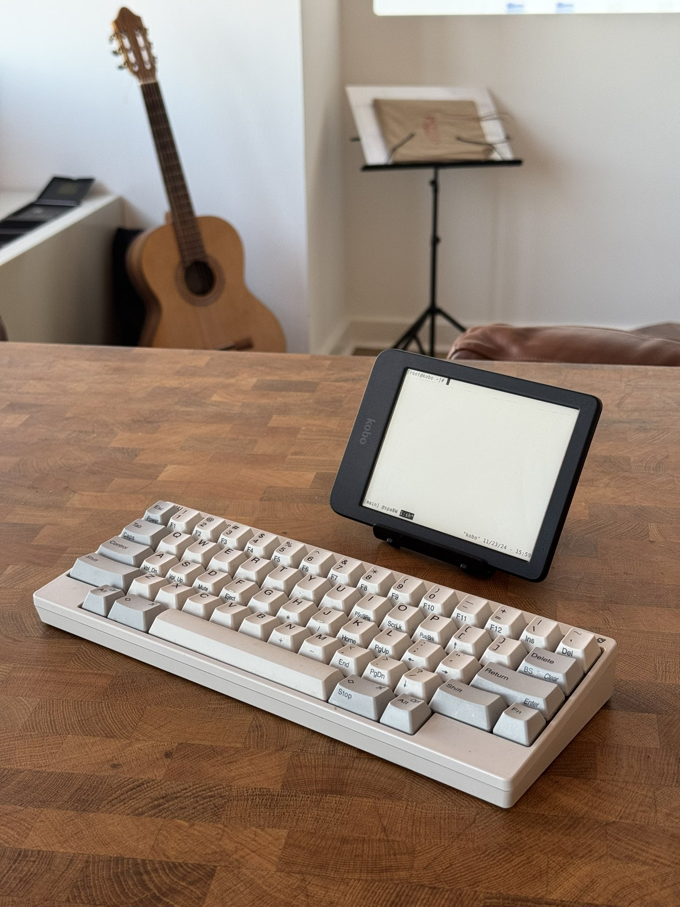

# efbpad

A prototype terminal for a Kobo Clara BW.
Type with a bluetooth keyboard.
This project is in a very early stage. 
See the long [TODO.md](TODO.md) and the project structure section below.

<p align="center">
  
  
</p>

## Usage

 - Run `make eink` to produce a package.
   This requires a cross-compiling environment.
   NiLuJe's `koxtoolchain` kobo env is the path of least resistance.
 - Install kfmon, nickelmenu, and [NiLuJe's Kobo utilities.](https://www.mobileread.com/forums/showthread.php?t=254214)
 - Merge the contents of `./root/mnt/onboard/` with the kobo's
   `/mnt/onboard`, or put the produced `KoboRoot.tgz` in `/mnt/onboard/.kobo`

kfmon should create an efbpad entry for the launch script, `efbpad.sh`
efbpad will only start if a bluetooth keyboard is paired and connected at
`/dev/input/event3`. 
When efbpad is started, it attaches to an existing tmux session or starts 
one if none exist. When tmux closes or the keyboard is disconnected, then
efbpad shuts down. 

For uninstallation, efbpad only creates these files and directories:
 - `/mnt/onboard/.adds/efbpad`
 - `/mnt/onboard/fonts/tf`
 - `/mnt/onboard/efbpad.png` 
 - `/mnt/onboard/.adds/kfmon/config/efbpad.ini`

## Project Structure
Others ran so efbpad could crawl.
It is mostly a threading together of other projects.
Broadly, there are 5 components. 
An effort has been made to keep them as decoupled as possible.
 - `FBInk`: A library for eink screen drawing by NiLuJe.
 - `tmux`: Terminal multiplexer. efbpad currently depends on
   NiLuJe's utilities package for its tmux build:
   [link](https://www.mobileread.com/forums/showthread.php?t=254214).
 - `fbpad`: A framebuffer terminal emulator by aligrudi.
   We use a very lightly patched version of fbpad: it occasionally
   makes a call to FBInk to refresh the screen.
    - Here we follow the example of `fbpad-eink`, which took a more
      integrated approach to refreshes and had a different keyboard system.
 - `kbreader`: Under proper conditions keyboards appear in linux as
   event devices. When you start `fbpad` it waits for chars from stdin.
   `kbreader` acts as the interpreter to translate keystrokes in an event
   device into strings printed to stdout. 
   We get `fbpad` to listen to the keyboard by piping kbreader into it as so:
   `kbreader /dev/input/event3 | fbpad the_shell`.
    - `kbreader` is spiritually identical to the onscreen keyboard in
      a similar project `inkvt`, except our event device is not a touchscreen,
      and we use fbpad instead of a bespoke VT.
 - `efbpad.sh`: Script that does efbpad startup & shutdown.

The included font `regular.tf` was converted using `fbpad_mkfn`:

```
$ ./mkfn -h 48 -w 24 DejaVuSansMono.ttf:42 > regular.tf
```
